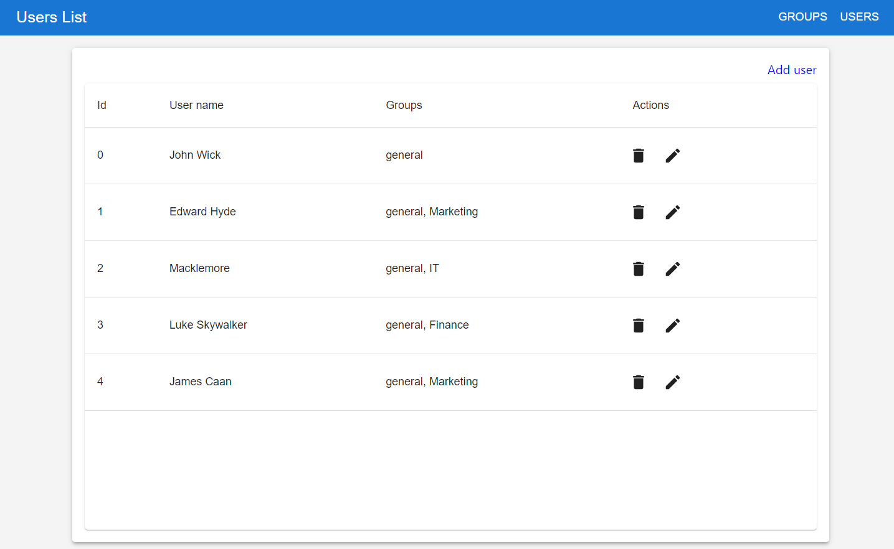

# User management

A simple React and Typescript app for user management.
Template created with create-react-app

## Start up

To install dependencies run:

`npm install`

To start in development mode:

`npm start`

## Libraries

 - Material UI for straightforward UI components
 - React router to handle routing

## About the development

 - Special focus was put in handling the async tasks properly and routing around the app
 - We use the AsyncOp type to track the different possible statuses of an async task
 - The project uses Domain Driven architecture. We have layers for:
    - Domain (Types which represent our business concepts).
    - Persistence, for interacting with the "outside world", like a REST API.
    - Presentation: Routes, Views and components

## About the app

 - There is a main view for Groups, and a secondary for users:

 

 

  - We can add new users and select their groups:

  

 ## Points of improvement

 - There is an error when trying ot edit an existing user, where the same group is selectable again.
 - All the mock async functiona resolve successfully after a timeout. In real life, we would need to implement proper error handling (Note that type AsyncOp) supports both success and error.
 - Lists have no pagination
 - No testing was added.
 - Styling needs to be improved, like the display of the links and the effects while reloading data, or the table size.